# JavaScript Capstone Project: Build an RPG game

# FOREST-CLASH 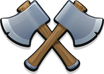

This is the Microverse's final project for the Javascript  course.

In this project i implemented a RPG game using [Phaser 3](http://phaser.io/tutorials), an open-source framework for Canvas and WebGL powered browser games.

## Table of Contents

  - [About](#about)
  - [The game](#the-game)
    - [How to play](#how-to-play)
    - [Design](#design)
      - [Player characters](#players-characters)
      - [Enemies](#enemies)
      - [Scenes](#scenes)
  - [Technologies used](#technologies-used)
  - [Contact](#contact)
  - [Acknowledgements](#acknowledgements)

## About

This project's objective was to build a platform game similar [gamedevacademy](https://gamedevacademy.org/how-to-create-a-turn-based-rpg-game-in-phaser-3-part-1/).The main idea is from the tutorial but I developed my own RPG with different levels.

The assignment can be seen [Here](https://www.notion.so/RPG-game-f94a617841e240a293c0b6928beebe89).

Link to a [live-version](https://cranky-lovelace-92c884.netlify.com/).

Repository: https://github.com/Tresor11/Phaser-RPG-Game

## The game

this is a turn-based game where you will have three characters, the game start with the first character (prospector) , you will be using him to find the enemies **spolier alert!!! they are hiding so you can't see them. move around and check every corner** when you find the enemies you will have your two other characters **Herus** and **ninja** to help you fighting the enemies. select the character you want to use with **keyboard arrows** and attack the enemy with **space**. the game has three levels and as you
progress you get stronger enemies and higher score.
###### 0- 50 level 1
###### 50- 200 level 2
###### 200- ++ level 3
on the left, of the screen, you can see the leader board and when the game end if you broke your record, it will be automatically updated on the leader board

### How to play
As explained in the previous section this is a turn basd game you will have two turns before the enemies get their own.
Use  to select the character you want to use and the enemy you want to attack, and press  to attack the selected enemy.

You can play the game online clicking [here](https://cranky-lovelace-92c884.netlify.com/) or locally following these steps:

##### clone the repo by typing 
~~~
git clone https://github.com/Tresor11/Phaser-RPG-Game
~~~

##### navigate to the folder by typing
~~~
cd Phaser-RPG-Game
~~~
##### get the Dependencies by typing

~~~
npm install
~~~

##### bundle the files and start the server by typing

~~~
npm run start
~~~

and have fun playing while you are getting a live update of your record on the leader board each time you break it

### Design

The Game wills start with your first character the prospector you will use him to find the hidden enemies when you find them you will be taken to the other screen which is the battle screen.
when you  are in the battle screen you will see your two heroes characters appear on the right and the enemies on the left of the screen, use the arrow keys on your keyboard to select your hero and press space to attack after you've attacked the enemies will automatically attack you, you can keep track of your remaining hp by looking at the health bar on the top left of your screen.if you won the battle you will be taken back to the main screen so that you can look for more enemies if you lost you will be taken to the game over screen 

#### players-characters

##### Prospector
use him to seek enemies in the forest

##### Ninja 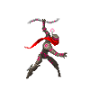
he is your most important asset for making damage to the enemies he has **150 damage*** and **80 Hp**

##### Herus 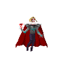
You cant count on him bear attacks from the enemies he has **50 damage** and **200 Hp**

#### Enemies

##### wizarus form 1 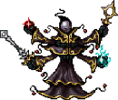

You will see him in level one(he can take different forms)  he has  **80 damage** and **80 Hp**

##### wizarus form 2 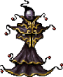
You will see him in level 1  **90 damage** and **90 Hp**

##### wizarus form 3 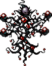

You will see him in level 2  **110 damage** and **100 Hp**

##### ghostus 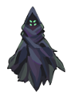

He is more powerfull than wizarus You will see him in level 3  **120 damage** and **150 Hp**

##### Master 

this is the enemy you want to defeat he is the MVP of opponents you see him in level 3  **150 damage** and **200 Hp**

#### Scenes

##### TItle scene
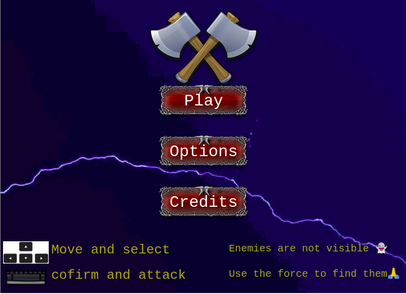

##### credit scene
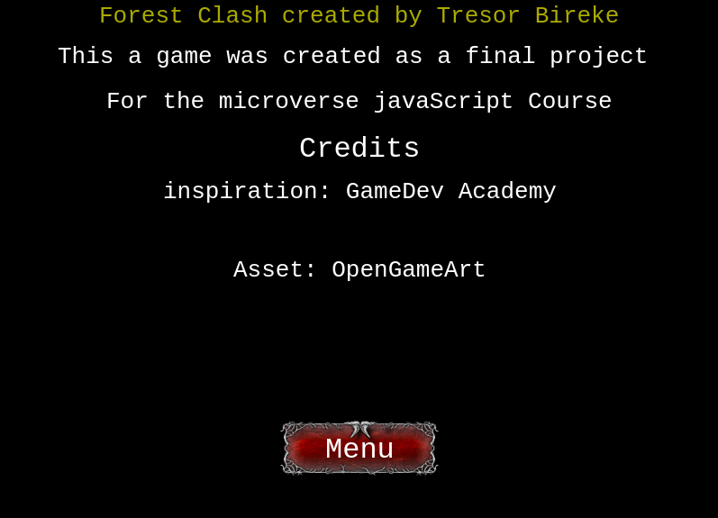

##### option scene
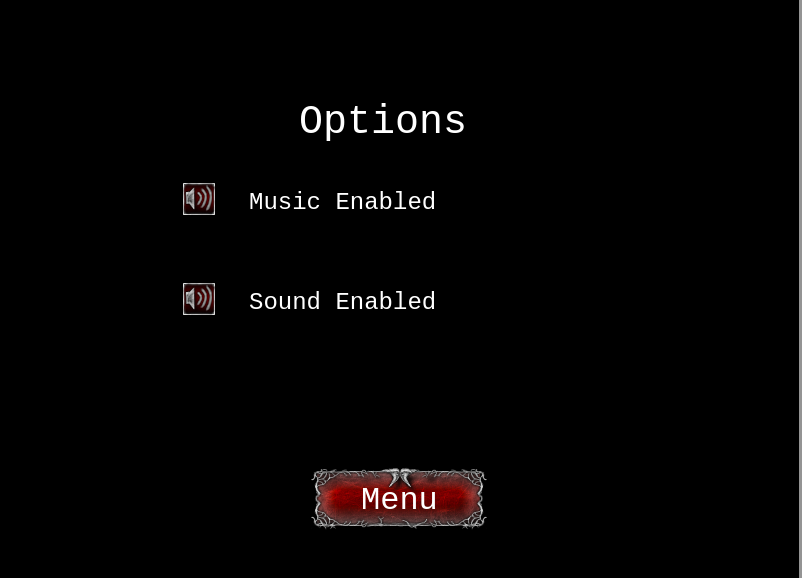

##### world scene
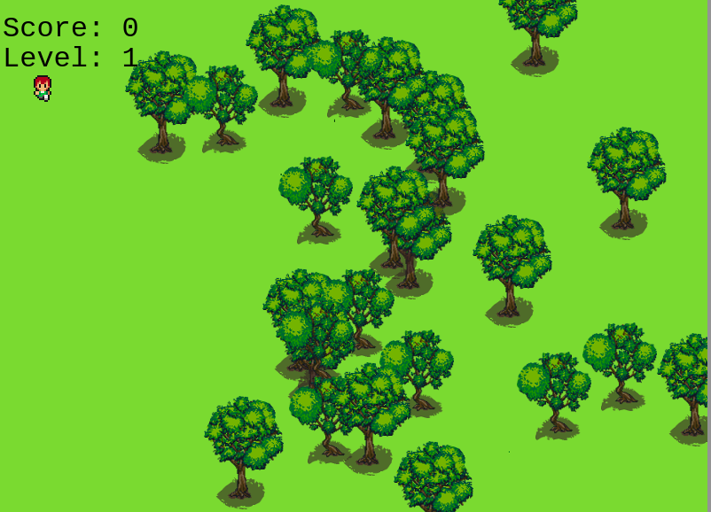

##### battle scene

##### Game Over

## Technologies used

* JavaScript
* A bit of HTML and CSS for the front end
* Phaser 3
* Webpack
* Eslint
* Babel
* Jest in the tests
* Github
* [Netlify](https://app.netlify.com/) for the deployment
* [Leaderboard API service](https://www.notion.so/Leaderboard-API-service-24c0c3c116974ac49488d4eb0267ade3) for the leaderboard

## Video presentation

https://www.loom.com/share/d4fc5b69fb4f45e9961cb5a3b745e7ae

## contact

👤 **Tresor**

- Github: [@ampaire](https://github.com/Tresor11)
- Twitter: [@AmpaPhem](https://twitter.com/Tbireke)

## 🤝 Contributing

Contributions, issues and feature requests are welcome!

Feel free to check the [issues page](https://github.com/Tresor11/Phaser-RPG-Game/issues).

## Show your support

Give a ⭐️ if you like this project!
